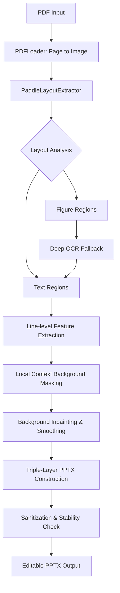

# PDF2PPTX: PDF to Editable PPTX Converter

PDF2PPTX is a powerful tool designed to convert PDF documents into editable PowerPoint (.pptx) presentations. Unlike simple conversion tools, it uses OCR and layout analysis to distinguish between text blocks and figures, ensuring that text remains editable and images are correctly placed.

## 🚀 Features

- **Triple-Layered Reconstruction**: Each slide is built with high fidelity:
    - **Layer 0 (Background)**: The untouched original PDF page for reference.
    - **Layer 1 (Cleaned)**: A reconstructed background with text removed via **Local Context Fill** (median color estimation for paper, selective inpainting for graphics).
    - **Layer 2+ (Text)**: Precisely overlaid editable text boxes.
- **Precise Typography**: Extracts line-level font heights from OCR to match the original document's font size ratio and proportions.
- **Intelligent Layout Analysis**: Uses PaddleOCR to distinguish text, titles, and figures with a hybrid fallback for scanned text-in-image extraction.
- **Robustness & Stability**: Implements XML sanitization and dimension safeguards to eliminate "Repair" prompts in PowerPoint.
- **Modular Design**: Separates PDF loading, layout extraction, and PPTX building for easy extensibility.

## 🔄 Workflow



## 🏗 Project Architecture

```text
pdf2pptx/
├── main.py                # Orchestrator & CLI
├── config.py              # Settings (DPI, Lang, Temp)
├── requirements.txt       # Dependencies
└── core/
    ├── loader.py          # PDF parsing (pdf2image)
    ├── extractor.py       # OCR, Layout & Cleaning (PaddleOCR, OpenCV)
    └── builder.py         # PPTX construction (python-pptx)
```

## 🛠 Prerequisites

### System Dependencies
The tool requires `poppler-utils` for PDF processing.

```bash
conda create -n pdf2pptx -c conda-forge poppler pip python=3.12 -y
conda activate pdf2pptx
```

## 📦 Installation

1. Clone the repository.
2. Install dependencies:
   ```bash
   pip install -r requirements.txt
   ```

## 🖥 Usage

```bash
python main.py <input_pdf_path> <output_pptx_path>
```

**Example:**
```bash
python main.py test.pdf output.pptx
```

## ⚙ Configuration

Settings in `config.py`:
- `OCR_LANG`: Language code (e.g., 'en', 'ch').
- `DPI`: Image resolution for OCR (default: 300).
- `TEMP_DIR`: Asset cache directory.

## ⚖ License
MIT License

